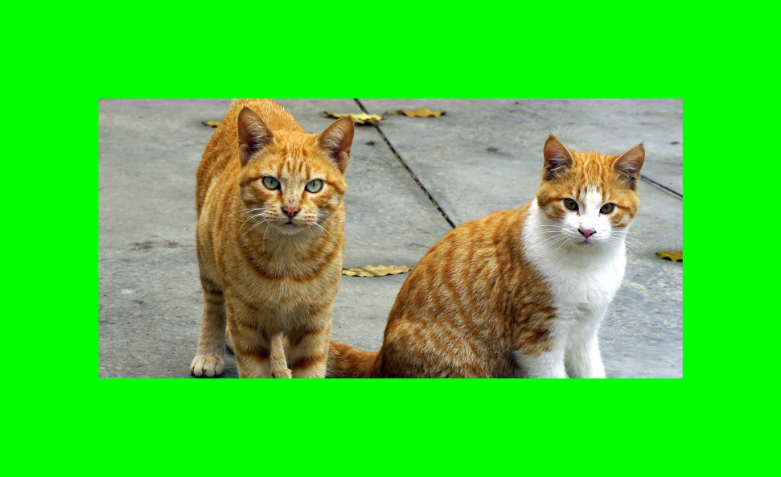

<style type="text/css">
div {
  font-size: clamp(10px, 2.4vw, 30px);
}

pre {
  font-size: 0.82em;
  line-height: 1.35em;
}

code {
  font-size: 0.92em;
}

table {
  font-size: 0.88em;
}
</style>

- [🐈 C Programming, Memory Model, Binary Data, and Modern Systems](#-c-programming-memory-model-binary-data-and-modern-systems)
- [Part 1: C Toolchain, Macros, and Language Basics](#part-1-c-toolchain-macros-and-language-basics)
- [Part 2: Pointers, Strings, and Memory Layout](#part-2-pointers-strings-and-memory-layout)
- [Part 3: Structure Alignment, Padding, and Packing](#part-3-structure-alignment-padding-and-packing)
- [Part 4: Binary Data, File Formats, and BMP Images](#part-4-binary-data-file-formats-and-bmp-images)
- [Part 5: Bitfields, Endianness, and Low-Level Data Representation](#part-5-bitfields-endianness-and-low-level-data-representation)
- [Part 6: Error Handling, Common Bugs, GDB, and Valgrind](#part-6-error-handling-common-bugs-gdb-and-valgrind)
- [Part 7: System Calls and the Kernel Interface](#part-7-system-calls-and-the-kernel-interface)
- [📦 Summary](#-summary)


#  🐈 C Programming, Memory Model, Binary Data, and Modern Systems

- Why C still matters for modern systems
- Preprocessor directives and macro pitfalls
- Pointers, arrays, strings, and function pointers
- Memory layout: stack, heap, text, data, BSS
- Structure alignment, padding, and packing
- Binary file I/O
- BMP files and image/tensor-like data
- Bitfields and endianness
- Error handling
- Common bugs and debugging with GDB/Valgrind
- System calls vs library functions
- Short Rust / high-level language comparisons

---

Resources:

- [System Programming Wiki](https://github.com/angrave/SystemProgramming/wiki)
- [GCC Documentation](https://gcc.gnu.org/onlinedocs/)
- [The Lost Art of Structure Packing](http://www.catb.org/esr/structure-packing/)

---


## Course language policy: Primary language is C

This course uses C as the main language because it gives direct access to:

- memory layout,
- pointers,
- binary data,
- system calls,
- file descriptors,
- processes,
- threads,
- IPC,
- sockets.

C is small, explicit, and close to the machine. That makes it ideal for learning system programming.
> Occasionally, we will show small Rust or high-level examples to compare ideas.

---

## 🤖 Why C still matters in 2026

Many modern systems are built on top of C/C++ or similar native languages:

- operating systems,
- databases,
- web servers,
- network stacks,
- game engines,
- embedded systems,
- vector databases,
- inference engines,
- image/audio/video processing systems,
- AI infrastructure.

Python is often the user-facing language, but performance-critical parts are frequently native code.

---

## 🧭 This is not just “C details.”

These topics are the foundation for:

- file-format parsers,
- image processing,
- dataset loaders,
- model-weight readers,
- vector databases,
- network servers,
- memory allocators,
- shells,
- operating-system tools.


---

## 🧠 Examples from AI/systems


- NumPy arrays are backed by contiguous C buffers.
- PyTorch/TensorFlow kernels are implemented in C/C++/CUDA.
- `llama.cpp` and other inference engines are native code.
- Vector databases store and search numeric embeddings efficiently.
- Dataset loaders read large binary/text files.
- Model checkpoints and tensor files use binary formats.

Key idea:

> AI systems are not magic. They are processes, memory, files, threads, sockets, and binary data.

---


# Part 1: C Toolchain, Macros, and Language Basics

---

## 🔧 Compiler directives and build steps

Recall the main compilation steps:

```bash
gcc -E main.c > main.i   ## Preprocess
gcc -S main.i            ## Generate assembly
gcc -c main.s            ## Assemble to object file
gcc main.o -o main       ## Link executable
```

Useful tools:

```bash
nm main.o                ## List symbols in object file
size main.o              ## Show section sizes
objdump -h main.o        ## Show sections
ldd main                 ## Show shared-library dependencies
```

---

## 🧪 Example program

```c
#include <stdio.h>

int main(void) {
    printf("Hello World\n");
    return 0;
}
```

Compile and inspect:

```bash
gcc -Wall -Wextra -g main.c -o main
./main
nm main | grep printf
ldd main
size main
```

Question:

> Where does `printf` come from?

---

## 🔬 Compilation deep dive

```bash
gcc -E main.c > main.i
```

The preprocessor expands:

- `#include` directives,
- `#define` macros,
- conditional compilation.

```bash
gcc -S main.i
```

Produces assembly code: `main.s`.

```bash
gcc -c main.s
```

Produces object file: `main.o`.

```bash
gcc main.o -o main
```

Links object files and libraries into an executable.

---

## 📦 Object files and symbols

Object files contain:

- machine code,
- initialized data,
- uninitialized data,
- symbol table,
- relocation information,
- section headers.

Use `nm` to inspect symbols:

```bash
nm main.o
```

You may see:

```text
U printf
T main
```

`U` means undefined. It will be resolved during linking.

---

## 🗂️ Program sections

Common ELF sections:

| Section | Meaning |
|---|---|
| `.text` | executable instructions |
| `.data` | initialized global/static variables |
| `.bss` | uninitialized global/static variables |
| `.rodata` | read-only data, such as string literals |
| `.symtab` | symbol table |
| `.rela.*` | relocation information |

Useful commands:

```bash
size main
objdump -h main
readelf -S main
```

---

## 🧩 Macros: object-like macros

Object-like macros are simple text substitutions.

```c
#define MAX_LENGTH 10

char buffer[MAX_LENGTH];
```

Expands to:

```c
char buffer[10];
```

Multi-line macro:

```c
#define NUMBERS 1, \
                2, \
                3

int x[] = { NUMBERS };
```

Expands to:

```c
int x[] = { 1, 2, 3 };
```

---

## 🧩 Macros: function-like macros

Function-like macros look like function calls but are expanded inline.

```c
#define min(X, Y) ((X) < (Y) ? (X) : (Y))

x = min(a, b);
```

Expands to:

```c
x = ((a) < (b) ? (a) : (b));
```

---

**Be careful with operator precedence.**

Bad:

```c
#define ceil_div(x, y) (x + y - 1) / y
```

Better:

```c
#define ceil_div(x, y) ((x) + (y) - 1) / (y)
```

---

## ⚠️ Macro pitfalls: side effects

```c
#define min(a, b) ((a) < (b) ? (a) : (b))

min(x++, 5);
```

This may increment `x` more than once.

Why?

The macro may expand to code where `x++` appears twice.

Prefer inline functions when possible:

```c
static inline int min_int(int a, int b) {
    return a < b ? a : b;
}
```

High-level comparison:

- C++: `constexpr`/inline functions
- Rust: normal functions or macros when needed
- Python: functions, but no compile-time macro expansion

---

## ⚠️ Macro pitfalls: duplicate evaluation

```c
#define min(X, Y) ((X) < (Y) ? (X) : (Y))

min(x + y, foo(z));
```

`foo(z)` may be executed twice.

This can cause:

- performance problems,
- unexpected side effects,
- hard-to-debug behavior.

Again, inline functions are often safer.

AI/systems example:

```c
min(compute_embedding_score(i), expensive_lookup(j));
```

You probably do not want `expensive_lookup` to run twice.

---

## ⚠️ Macro pitfalls: semicolons

Multi-statement macros can cause problems:

```c
#define SKIP_SPACES(p, limit) { /* ... */ }

if (*p != 0)
    SKIP_SPACES(p, lim);
else
    /* ... */
```

The extra semicolon may break the `if`/`else`.

Common fix:

```c
#define SKIP_SPACES(p, limit) \
    do {                      \
        /* ... */             \
    } while (0)
```

---

## 🔀 Macro conditionals

Macros can be used for conditional compilation.

```c
#ifdef __GNUC__
    return 1;   // Compiled with GCC
#else
    return 0;
#endif
```

This is useful for:

- portable code,
- platform-specific features,
- debug builds,
- optional tracing/logging,
- enabling/disabling experimental features.

Example:

```c
#ifdef DEBUG_LOG
    fprintf(stderr, "loading tensor file\n");
#endif
```

---

## 🔑 C keywords and important concepts

Important keywords:

- `extern`
- `const`
- `static`
- `sizeof`
- `struct`
- `union`
- `typedef`
- `volatile`
- `inline`

These affect:

- visibility,
- lifetime,
- type layout,
- optimization,
- linkage.

Question:

> What is the difference between `static` inside a function and `static` for a global variable?

---

## 🔢 Basic data types

Basic types:

- `char`
- `short`
- `int`
- `long`
- `float`
- `double`

Fixed-width integers from `<stdint.h>`:

```c
uint8_t  b;
int32_t  x;
uint64_t y;
```

Fixed-width types are especially important for:

- binary file formats,
- network protocols,
- image processing,
- serialization,
- tensor headers,
- model-weight files.

---

## 🧮 Operator precedence: important cases

Some precedence cases to remember:

| Expression | Meaning |
|---|---|
| `a[i]` | array subscript |
| `p->x` | member access through pointer |
| `(*p).x` | dereference then member access |
| `*p++` | dereference current `p`, then increment pointer |
| `(*p)++` | increment the pointed-to value |
| `sizeof x` | size of expression/type |
| `(type)x` | cast |

When in doubt, use parentheses.

---

## 🔁 Shift operators and bit operations

Unsigned right shift is zero-filled.

Signed right shift is often sign-extended, but some behavior is implementation-defined.

Example:

```c
unsigned short uns = 0xFF81;
uns >>= 2;   // 0x3FE0, zero-filled
```

Bit operations are essential for:

- pixel manipulation,
- binary file formats,
- flags,
- network protocols,
- steganography,
- watermarking,
- low-level hardware interfaces.

---

# Part 2: Pointers, Strings, and Memory Layout

---

## 🧭 Pointers

Declaration pitfalls:

```c
int* ptr1, ptr2;   // ptr2 is an int, not a pointer
int *ptr3, *ptr4;  // both are pointers
```

Pointer arithmetic:

```c
char *ptr = "Hello";
ptr += 2;          // points to 'l'
```

For typed pointers, arithmetic depends on the element size:

```c
int *p;
p += 1;            // advances by sizeof(int) bytes
```

High-level analogy:

- C pointer + length is like a raw buffer view.
- Rust slice is a safer pointer + length.
- Python `bytes`/`memoryview` also represent buffer views, but with less manual control.

---

## ➕ Pointer arithmetic example

```c
int arr[] = {10, 20, 30};
int *p = arr;

printf("%d\n", *p);      // 10
p++;
printf("%d\n", *p);      // 20
printf("%d\n", p[1]);    // 30
```

Array indexing is defined in terms of pointer arithmetic:

```c
arr[i] == *(arr + i)
```

This is why arrays and pointers are closely related in C.

---

## 🕳️ Void pointers

```c
void *p = malloc(10);
char *s = p;       // valid implicit conversion in C
```

`void *` is a generic pointer type.

But:

- pointer arithmetic on `void *` is not standard C,
- you should cast to a complete pointer type before arithmetic,
- `malloc` returns `void *`.

Example:

```c
int *data = malloc(10 * sizeof(int));
```

Modern systems use `void *` heavily for generic buffers.

---

## 🤖 Pointer example: vectors and embeddings

Many modern systems process arrays of numbers:

- embeddings,
- feature vectors,
- tensors,
- sensor data,
- audio samples,
- pixel buffers.

Example:

```c
typedef struct {
    size_t length;
    double *data;
} Vector;
```

This simple structure already contains the core idea:

> pointer + length

That pattern appears everywhere in systems programming.

---

## 🧮 Pointer example: dot product

```c
double dot_product(const double *a, const double *b, size_t n) {
    double sum = 0.0;

    for (size_t i = 0; i < n; i++) {
        sum += a[i] * b[i];
    }

    return sum;
}
```

Dot products appear in:

- similarity search,
- recommendation systems,
- vector databases,
- machine-learning kernels,
- signal processing.

This is one of the simplest “AI infrastructure” examples.

---

## 🦀 Rust corner: pointer + length vs slice

C often uses pointer + length:

```c
double dot(const double *a, const double *b, size_t n) {
    double sum = 0.0;

    for (size_t i = 0; i < n; i++) {
        sum += a[i] * b[i];
    }

    return sum;
}
```

Rust uses slices:

```rust
fn dot(a: &[f64], b: &[f64]) -> f64 {
    let mut sum = 0.0;

    for i in 0..a.len() {
        sum += a[i] * b[i];
    }

    sum
}
```

The slice carries length information. C requires the programmer to manage length correctly.

---

## 🔤 C strings

String constants are stored in a read-only data section:

```c
char *str = "constant";
```

Modifying this string causes undefined behavior.

Mutable strings:

```c
char str[] = "mutable";        // stack or data segment
char *heap_str = malloc(10);   // heap
```

Always know where your string memory lives.

AI/systems note:

Text processing, tokenization, dataset parsing, and log processing often involve lots of C strings or byte buffers.

---

## 🏠 Program memory layout

A C process has several important memory regions:

| Region | Purpose |
|---|---|
| Stack | local variables, function frames |
| Heap | dynamically allocated memory |
| Text | executable machine code |
| Data | initialized global/static variables |
| BSS | uninitialized global/static variables |

Question:

> Where does a local variable live?
> Where does `malloc` memory live?
> Where does a string literal live?

---

## 🏠 Program memory layout example

```c
int global_init = 5;        // data segment
int global_uninit;          // BSS

int main(void) {
    int local;              // stack
    int *p = malloc(10);    // p on stack, pointed memory on heap

    if (p) {
        free(p);
    }

    return 0;
}
```

Important distinction:

- The pointer variable `p` is on the stack.
- The memory it points to is on the heap.

---

## 🔤 String constants vs arrays

```c
char *s0 = "abc";
char *s1 = "abc";

char s2[] = "abc";
char s3[] = "abc";
```

`s0` and `s1` may point to the same read-only literal.

`s2` and `s3` are separate mutable arrays.

Important:

```c
s0[0] = 'x';   // undefined behavior, usually crash
s2[0] = 'x';   // OK
```

---

## 🔒 Constant pointers vs pointers to constants

Pointer to constant:

```c
const int *ptr = &a;
// *ptr = 10;  // error
```

Constant pointer:

```c
int *const ptr = &a;
// ptr = &b;   // error
```

Constant pointer to constant:

```c
const int *const ptr = &a;
// neither pointer nor pointed value can change through ptr
```

Modern systems code often uses `const` heavily to make APIs safer.

Rust analogy:

- `&T` is like a shared immutable borrow.
- `&mut T` is like a mutable borrow.
- C gives you more freedom, but fewer compiler checks.

---

## 🎯 Function pointers

Function pointers allow polymorphism in C.

Syntax:

```c
int (*compare)(int, int);
```

Simple example:

```c
int add(int a, int b) {
    return a + b;
}

int main(void) {
    int (*op)(int, int) = add;
    int result = op(3, 4);  // 7
    return 0;
}
```

---

## 📞 Function pointers: callback style

Function pointers are used in:

- callbacks,
- event systems,
- sorting functions,
- plugin systems,
- operation tables,
- interpreters,
- inference pipelines.

Example with `qsort`-style comparison:

```c
int intcmp(const void *a, const void *b) {
    int x = *(const int *)a;
    int y = *(const int *)b;

    return (x > y) - (x < y);
}
```

---

## 📞 Using a comparison function pointer

```c
int main(void) {
    int (*comp)(const void *, const void *) = intcmp;

    int x = 3;
    int y = 5;

    int z = comp(&x, &y);

    printf("comparison result: %d\n", z);
    return 0;
}
```

This is a simple form of runtime polymorphism in C.

---

## 🦀 High-level comparison: function pointers

C:

```c
int (*op)(int, int) = add;
```

Rust function pointer:

```rust
fn add(a: i32, b: i32) -> i32 {
    a + b
}

let op: fn(i32, i32) -> i32 = add;
```

Rust closure:

```rust
let op = |a, b| a + b;
```

Python callable:

```python
def add(a, b):
    return a + b

op = add
```

Same idea:

> Store and pass behavior as data.

---

## 🤖 AI/systems example: function pointers

Function pointers can represent operations in a pipeline:

```c
typedef double (*activation_fn)(double x);

double relu(double x) {
    return x > 0 ? x : 0;
}

double sigmoid(double x) {
    return 1.0 / (1.0 + exp(-x));
}
```

Then choose an operation at runtime:

```c
activation_fn f = relu;
double y = f(x);
```

This pattern appears in:

- model layers,
- optimization functions,
- data transformations,
- plugin architectures.

---

## 🧱 Structs and pointers

```c
typedef struct {
    int a1;
    int a2;
} Pair;

Pair obj = {10, 15};
Pair *ptr = &obj;

*ptr = (Pair){0, 0};

printf("a1: %d, a2: %d\n", ptr->a1, ptr->a2);
```

Memory layout:

```text
+---------+---------+
| 10 (a1) | 15 (a2) |
+---------+---------+
```

---

## 🧱 Structs and memory model

```c
Pair obj = {10, 15};
int *ptr = (int *)&obj;

printf("a1: %d, a2: %d\n", *ptr, *(ptr + 1));
```

Possible output:

```text
a1: 10, a2: 15
```

This works if `Pair` contains two adjacent `int` members with no padding between them.

Be careful:

> Casting struct pointers to integer pointers can be non-portable if padding, alignment, or member order changes.

---

## ⚠️ Invalid or dangerous pointer arithmetic

```c
Pair obj = {10, 15};
Pair *ptr2 = ptr + 1;
```

If `obj` is a single object, not an array, then `ptr + 1` points past that object.

Dereferencing it is invalid.

This is a common systems bug:

- assuming a pointer points to an array,
- reading beyond the end of a buffer,
- writing beyond the end of a struct.

These bugs can cause crashes, corrupted data, or security holes.

---

## 🦀 Struct memory layout across languages

C:

```c
typedef struct {
    uint8_t b;
    uint8_t g;
    uint8_t r;
    uint8_t a;
} Pixel;
```

Rust:

```rust
#[repr(C)]
struct Pixel {
    b: u8,
    g: u8,
    r: u8,
    a: u8,
}
```

Python `ctypes`:

```python
class Pixel(ctypes.Structure):
    _fields_ = [
        ("b", ctypes.c_uint8),
        ("g", ctypes.c_uint8),
        ("r", ctypes.c_uint8),
        ("a", ctypes.c_uint8),
    ]
```

If languages disagree about layout, binary communication fails.

---

# Part 3: Structure Alignment, Padding, and Packing

---

## 📏 Structure alignment and padding

Modern CPUs prefer aligned memory accesses.

Typical alignment rules:

| Type | Alignment |
|---|---|
| `char` | any address |
| `short` | even address |
| `int`, `float` | divisible by 4 |
| `long`, `double`, pointers | divisible by 8 on many systems |

The compiler may insert padding between struct members.

Question:

> If a struct has a `char` and an `int`, will its size be 5 bytes?

---

## 📏 Alignment example

```c
struct foo1 {
    char *p;   // 8 bytes on many systems
    char c;    // 1 byte
    long x;    // 8 bytes
};
```

Possible layout:

```text
p: 8 bytes
c: 1 byte
padding: 7 bytes
x: 8 bytes
```

Total size may be 24 bytes.

---

## 🌍 Why alignment matters in modern systems

Structure layout matters for:

- binary file formats,
- network packets,
- memory-mapped files,
- shared memory,
- image headers,
- tensor headers,
- serialization,
- FFI between C and other languages.

If two programs disagree about struct layout, they may read garbage data.

This is especially important when reading/writing binary files.

---

## 🧮 Padding example

```c
struct unoptimized {
    char c;
    int x;
};
```

Possible layout:

```text
+---+---+---+---+---------------+
| c | padding |       x         |
+---+---+---+---+---------------+
```

Size may be 8 bytes, not 5.

Reordering can reduce padding:

```c
struct optimized {
    int x;
    char c;
};
```

But the compiler may still add trailing padding to satisfy alignment of arrays.

---

## 🔁 Structure reordering

Minimize padding by ordering members from largest alignment to smallest.

Inefficient:

```c
struct foo10 {
    char c;
    struct foo10 *p;
    short x;
};
```

Optimized:

```c
struct foo11 {
    struct foo11 *p;
    short x;
    char c;
};
```

The second version usually uses less memory.

See [The Lost Art of Structure Packing](http://www.catb.org/esr/structure-packing/).

---

## 🧰 GCC attributes: packed

`packed` removes padding:

```c
struct __attribute__((packed)) picture {
    char height;
    int **data;
    int width;
    char *encoding;
};
```

Possible size:

```text
1 + 8 + 4 + 8 = 21 bytes
```

Warning:

> Packed structures may cause unaligned accesses, which can be slower or invalid on some architectures.

---

## 🧰 GCC attributes: aligned

`aligned` enforces alignment:

```c
struct __attribute__((packed, aligned(4))) picture2 {
    char height;
    int **data;
    int width;
    char *encoding;
};
```

This may round the size up to a multiple of 4.

Useful for:

- SIMD data,
- cache-line alignment,
- DMA buffers,
- binary formats with explicit alignment.

---

## 📦 Flexible array members

C99 allows a flexible array member at the end of a struct.

```c
struct array {
    int size;
    char data[];
};

int main(void) {
    struct array *var = malloc(sizeof(*var) + 32 * sizeof(char));
    var->size = 32;
    var->data[31] = 2;

    printf("Size: %zu\n", sizeof(struct array));
    return 0;
}
```

This is useful for variable-length messages, packets, and records.

---

## 🦀 Rust corner: C-compatible layout

C:

```c
typedef struct {
    uint8_t b;
    uint8_t g;
    uint8_t r;
    uint8_t a;
} Pixel;
```

Rust can use C-compatible layout:

```rust
#[repr(C)]
struct Pixel {
    b: u8,
    g: u8,
    r: u8,
    a: u8,
}
```

This is useful for FFI and binary data formats.

---

## 🤖 AI/systems example: simple tensor header

A simple binary tensor format could look like this:

```c
typedef struct {
    uint32_t magic;
    uint32_t version;
    uint32_t length;
    uint32_t dtype;
} TensorHeader;
```

Followed by raw numeric data.

Important questions:

- Is the file little-endian or big-endian?
- Is the struct packed?
- Are fields fixed-width?
- What happens on a 32-bit vs 64-bit system?

These are exactly the issues addressed by C memory model and binary I/O.

---

# Part 4: Binary Data, File Formats, and BMP Images

---

## 🧾 Binary file formats and headers

Many real-world formats have a header followed by raw data:

- BMP,
- PNG,
- WAV,
- ELF,
- network packets,
- tensor files,
- checkpoint files,
- embedding files.

Typical header fields:

```c
struct Header {
    uint32_t magic;
    uint32_t version;
    uint32_t width;
    uint32_t height;
    uint32_t data_offset;
};
```

---

## 🧾 Designing binary formats

When designing binary formats, you must think about:

- endianness,
- padding,
- alignment,
- versioning,
- field sizes,
- reserved fields,
- compatibility across platforms.

A good format should be explicit.

Prefer fixed-width types:

```c
uint8_t
uint16_t
uint32_t
int32_t
uint64_t
```

Do not assume `int` or `long` has the same size everywhere.

---

## 🌊 Streams and file I/O

Default streams:

- `stdin`
- `stdout`
- `stderr`

C library file functions:

```c
FILE *f = fopen("file.bmp", "rb");
fclose(f);

fread(buffer, size, count, file);
fwrite(buffer, size, count, file);
fseek(f, offset, SEEK_SET);
```

For binary data, always open files with `"rb"` or `"wb"`.

---

## 🌊 Binary mode matters

On Unix-like systems, text mode and binary mode are often the same.

But for portable code, always use:

```c
"rb"
"wb"
```

for binary files.

This is important for:

- BMP files,
- tensor files,
- serialized data,
- network protocol dumps,
- checkpoint files.

---

## 🖼️ BMP file structure

BMP files are a good example of binary file formats.

Main parts:

1. BMP file header
2. DIB header
3. Optional color table
4. Pixel data

---

Important fields:

- file type,
- file size,
- offset to pixel data,
- width,
- height,
- bits per pixel.

---

For a 32-bit BMP, pixels are often stored as BGRX:

```text
B G R X
```

where `X` may be unused.

---

## 🖼️ Demo: read a BMP and put a frame around the image

<table>
  <tr>
    <th>Input image</th>
    <th>Output image</th>
  </tr>
  <tr>
    <td>
      
    </td>
    <td>
      
    </td>
  </tr>
</table>

The idea:

1. Read BMP header.
2. Copy header.
3. Read pixel data.
4. Replace border pixels with a frame color.
5. Write output BMP.

---

## 🖼️ Reading BMP header fields

```c
FILE *f = fopen("image.bmp", "rb");

uint32_t offset, width, height;
uint16_t nplanes, nbits;

fseek(f, 10, SEEK_SET);
fread(&offset, 4, 1, f);

fseek(f, 18, SEEK_SET);
fread(&width, 4, 1, f);
fread(&height, 4, 1, f);

fread(&nplanes, 2, 1, f);
fread(&nbits, 2, 1, f);

printf("offset: %u, width: %u, height: %u, planes: %u, bits: %u\n",
       offset, width, height, nplanes, nbits);

fclose(f);
```

---

## 🖼️ Copying an image header

```c
uint8_t *fheader = malloc(offset);

rewind(infile);

fread(fheader, 1, offset, infile);
fwrite(fheader, 1, offset, outfile);

free(fheader);
```

After copying the header, pixel data can be processed and written.

This pattern is common:

1. read header,
2. allocate memory,
3. read payload,
4. transform payload,
5. write new file.

---

## 🎨 Pixel manipulation with a union

```c
typedef union {
    uint32_t pixel;
    struct {
        uint8_t b;
        uint8_t g;
        uint8_t r;
        uint8_t a;
    } __attribute__((packed));
} Pixel;
```

This allows accessing the pixel as:

- one 32-bit integer,
- or four separate bytes.

This is useful for image processing, steganography, and watermarking.

---

## 🎨 Pixel union example

```c
Pixel p;
p.pixel = 0x12345678;

printf("b: %02x\n", p.b);
printf("g: %02x\n", p.g);
printf("r: %02x\n", p.r);
printf("a: %02x\n", p.a);
```

On a little-endian machine:

```text
b: 78
g: 56
r: 34
a: 12
```

This is useful for:

- BMP processing,
- steganography,
- watermarking,
- image filters,
- frame drawing.

---

## 🖼️ Example: adding a frame to an image

```c
Pixel p;
uint32_t FRAME_COLOR = 0x000000FF;

rewind(infile);
fseek(infile, offset, SEEK_SET);

for (uint32_t i = 0; i < height; i++) {
    for (uint32_t j = 0; j < width; j++) {
        fread(&p.pixel, 4, 1, infile);

        if (j < 50 || i < 50 ||
            i > height - 50 ||
            j > width - 50) {
            fwrite(&FRAME_COLOR, 4, 1, outfile);
        } else {
            fwrite(&p.pixel, 4, 1, outfile);
        }
    }
}
```

---

## 🧱 Example program structure: `frame.c`

A simple BMP frame program usually does the following:

1. Open input and output BMP files.
2. Read BMP header fields.
3. Copy the header to the output file.
4. Seek to the beginning of pixel data.
5. Read pixels one by one.
6. Replace border pixels with a frame color.
7. Write all pixels to the output file.
8. Close files and free allocated memory.

This is a good example of:

- binary I/O,
- offsets,
- struct/union usage,
- memory allocation,
- file processing.

---

## 🧠 Images as binary data and tensor-like data

An image can be viewed as:

- a binary file,
- a 2D array,
- a tensor,
- a buffer of pixels.

This connects C file I/O to modern AI systems:

- images,
- embeddings,
- model weights,
- checkpoints,
- feature vectors,
- dataset files.

The same low-level ideas apply:

- binary headers,
- offsets,
- endianness,
- alignment,
- memory allocation,
- streaming large files.

---

## 🕵️ Steganography and watermarking

Least-significant-bit steganography modifies low bits of pixel values:

```text
Original byte: 10110110
Modified byte: 10110111
```

The visual change is small, but hidden data can be embedded.

Modern related ideas:

- watermarking generated images,
- hiding metadata,
- detecting modified media,
- understanding binary manipulation.

This is why bit-level operations are still relevant.

---

# Part 5: Bitfields, Endianness, and Low-Level Data Representation

---

## 🧮 Bitfields

Bitfields allow specifying field sizes in bits:

```c
struct pixel {
    unsigned int b : 8;
    unsigned int g : 8;
    unsigned int r : 8;
    unsigned int a : 8;
};
```

They can be useful for compact representations.

However:

- layout may be implementation-dependent,
- padding and ordering are not always portable,
- use carefully in binary file formats.

---

## 🧮 Union example: bitfields and integers

```c
union {
    uint32_t value;
    struct pixel components;
} pixel_data;

pixel_data.value = 0x12345678;
```

On a little-endian machine, depending on layout:

```text
b = 0x78
g = 0x56
r = 0x34
a = 0x12
```

Be careful:

> Bitfield layout is implementation-dependent.

---

## 🔧 LSB manipulation

To set the least significant bit:

```c
uint8_t set_lsb(uint8_t byte, uint8_t bit) {
    return (byte & 0xFE) | (bit & 1);
}
```

To get the least significant bit:

```c
uint8_t get_lsb(uint8_t byte) {
    return byte & 1;
}
```

These operations are used in:

- steganography,
- watermarking,
- compression,
- encoding,
- low-level protocol handling.

---

# Part 6: Error Handling, Common Bugs, GDB, and Valgrind

---

## 🚨 Error handling in C

Common error handling tools:

- `errno`
- `strerror(errno)`
- `perror("message")`

Example:

```c
#include <stdio.h>
#include <errno.h>
#include <string.h>

int main(void) {
    FILE *f = fopen("/nonexistent/file.txt", "r");

    if (f == NULL) {
        fprintf(stderr, "Error code: %d\n", errno);
        fprintf(stderr, "Error message: %s\n", strerror(errno));
        perror("Failed to open file");
    }

    return 0;
}
```

Always check return values of file and system functions.

---

## 🦀 Rust corner: `errno` vs `Result`

C often uses return codes and `errno`:

```c
FILE *f = fopen("data.bin", "rb");

if (!f) {
    perror("fopen failed");
}
```

Rust uses `Result`:

```rust
use std::fs::File;

let f = File::open("data.bin");
```

With `?`:

```rust
use std::fs::File;

fn main() -> Result<(), Box<dyn std::error::Error>> {
    let _f = File::open("data.bin")?;
    Ok(())
}
```

Main idea:

- C errors are often easy to ignore.
- Rust errors are explicit in the type system.

---

## 🐞 Common bugs in C programs

### Dangling pointer

```c
int *p = malloc(sizeof(int));
free(p);
*p = 123;   // undefined behavior
```

### Double free

```c
free(p);
free(p);    // undefined behavior
```

Good habit:

```c
free(p);
p = NULL;
```

---

## 🐞 Common bugs: buffer overflow

```c
#define N 10
int array[N];

for (int i = N; i >= 0; i--) {
    array[i] = i;   // array[N] is invalid
}
```

Fix:

```c
for (int i = N - 1; i >= 0; i--) {
    array[i] = i;
}
```

Buffer overflows are a major source of crashes and security bugs.

---

## 🐞 Common bugs: uninitialized memory

```c
int x;
int y = x + 2;   // undefined behavior
```

Fix:

```c
int x = 0;
int y = x + 2;
```

Also initialize:

- pointers,
- structs,
- arrays,
- file buffers,
- allocated memory if needed.

---

## 🐞 Common bugs: fread/fwrite assumptions

Do not assume that `fread` always reads the full requested amount.

```c
size_t n = fread(buffer, 1, expected, f);

if (n != expected) {
    // handle short read or error
}
```

Possible reasons:

- end of file,
- I/O error,
- reading from a pipe/socket,
- interrupted operation.

In systems programming, always check return values.

---

## 🧪 Debugging with GDB

Compile with debug symbols:

```bash
gcc -g -o program program.c
```

Run:

```bash
gdb ./program
```

Useful GDB commands:

```text
break main
run
next
step
print x
backtrace
```

GDB is especially useful for:

- segmentation faults,
- invalid pointer dereferences,
- array bounds bugs,
- stack traces,
- inspecting variables.

---

## 🧪 GDB example

```c
#include <stdio.h>

int main(void) {
    int val = 1;
    val = 42;
    asm("int $3"); // Trigger breakpoint manually
    val = 7;
    return 0;
}
```

Compile and debug:

```bash
gcc -g -o example example.c
gdb ./example
```

Inside GDB:

```text
run
print val
backtrace
next
```

---

## 🧠 Memory leak detection with Valgrind

Compile with debug symbols:

```bash
gcc -g -o program program.c
```

Run:

```bash
valgrind --leak-check=full ./program
```

Example output:

```text
==12345== 40 bytes in 1 blocks are definitely lost
==12345==    at 0x483B7F3: malloc
==12345==    by 0x1091FE: main
```

Valgrind helps find:

- memory leaks,
- invalid reads,
- invalid writes,
- use-after-free,
- uninitialized memory use.

---

## 🦀 Rust corner: compile-time safety vs runtime debugging

C bug:

```c
int *p = malloc(sizeof(int));
free(p);
*p = 42;   // undefined behavior
```

Rust ownership prevents some invalid uses:

```rust
let s = String::from("hello");
let t = s;

// println!("{}", s); // compile error: value used after move
```

Key idea:

- C often requires runtime tools like Valgrind/GDB.
- Rust tries to catch some of these bugs at compile time.

But Rust is not magic: unsafe Rust and logic bugs still exist.

---

# Part 7: System Calls and the Kernel Interface

---

## 🏛️ System calls vs library functions

System calls are direct requests to the kernel:

- `open`
- `read`
- `write`
- `fork`
- `exec`
- `mmap`

C library functions may wrap system calls:

- `fopen`
- `fread`
- `fwrite`
- `printf`
- `malloc`

Important distinction:

> A library function may eventually use one or more system calls, but it is not necessarily a system call itself.

---

## 🏛️ System call example

```c
#include <unistd.h>

int main(void) {
    write(1, "Hello World\n", 12);
    _exit(0);
}
```

Here:

- `write` is a system call wrapper,
- file descriptor `1` is stdout,
- `_exit` terminates the process.

---

## 🏛️ User mode and kernel mode

System calls transition the CPU from user mode to kernel mode.

Simplified flow:

```text
User program
   ↓ system call
Kernel mode
   ↓ perform privileged operation
Return to user mode
```

Why this matters:

- system calls are relatively expensive,
- kernel operations are privileged,
- errors are reported through return values and `errno`,
- buffered I/O can reduce syscall overhead.

---

## 🧾 Brief assembly view

On x86-64 Linux, a `write` syscall roughly uses:

```asm
movq $1, %rax      ; syscall number for write
movq $1, %rdi      ; file descriptor 1 = stdout
movq $msg, %rsi    ; buffer address
movq $12, %rdx     ; length
syscall
```

You do not need to memorize this for the course.

The important conceptual points are:

- syscall number,
- arguments in registers,
- transition to kernel mode,
- return value.

---

## 🔎 Observing system calls with `strace`

A modern way to observe system calls is:

```bash
strace ./program
```

Example:

```bash
strace ./a.out
```

You may see calls such as:

```text
openat(...)
read(...)
write(...)
close(...)
mmap(...)
exit_group(...)
```

This is often more useful than reading assembly manually.

Useful tools:

```bash
strace ./program
ltrace ./program
ldd ./program
nm ./program
```

---

## ⚡ Interrupts, exceptions, and traps

| Type | Description | Example |
|---|---|---|
| Interrupt | asynchronous hardware event | keyboard input |
| Exception | synchronous error | page fault, division by zero |
| Trap | intentional transition to kernel | system call |

These concepts explain how user programs interact with the operating system.

We will see them again when discussing:

- signals,
- processes,
- virtual memory,
- file I/O.

---

## ✅ Best practices

1. Always check return values.
2. Initialize variables.
3. Set freed pointers to `NULL`.
4. Use fixed-width integers for binary formats.
5. Be careful with struct padding and packing.
6. Use `const` where appropriate.
7. Use GDB for crashes.
8. Use Valgrind for memory bugs.
9. Use `strace` to observe system calls.
10. Avoid unnecessary system-call overhead by batching I/O.

Also:

- Use `fgets` instead of `gets`.
- Validate input sizes to prevent buffer overflows.
- Initialize pointers to `NULL` and variables to default values.

---

## 🧪 Suggested in-class demos

Useful live demos:

1. Compile a simple program step by step:

```bash
gcc -E main.c > main.i
gcc -S main.i
gcc -c main.s
gcc main.o -o main
```

2. Inspect symbols and sections:

```bash
nm main.o
size main
objdump -h main
ldd main
```

3. Print struct sizes with and without packing:

```bash
gcc -Wall -Wextra -g struct_size.c -o struct_size
./struct_size
```

4. Run Valgrind on a leaky program:

```bash
valgrind --leak-check=full ./leaky
```

5. Trace system calls:

```bash
strace ./main
```

---

## 🧠 Mini quiz

1. What is the difference between an object file and an executable?
2. Why can `sizeof(struct)` be larger than the sum of member sizes?
3. What is wrong with modifying `char *s = "abc";`?
4. Why is `min(x++, 5)` dangerous if `min` is a macro?
5. What does `U` mean in `nm` output?
6. Why should binary files be opened with `"rb"`/`"wb"`?
7. What is the difference between `fopen` and `open`?

---

# 📦 Summary

In this lecture we covered:

- why C remains important for modern systems,
- macros and their pitfalls,
- pointers, strings, and memory layout,
- structs, alignment, padding, and packing,
- binary file I/O,
- BMP/image processing as a binary-format example,
- bitfields and endianness,
- common C bugs,
- debugging with GDB and Valgrind,
- system calls vs library functions,
- short Rust/high-level comparisons.

---

## ➡️ Next lecture

Next:

- Unix file I/O,
- file descriptors,
- `open`, `read`, `write`, `close`,
- `stat`, `fstat`, `lseek`,
- processes,
- `fork`, `exec`, `wait`,
- simple shell implementation.

And yes:

> The shell is where many system-programming concepts start to come together.